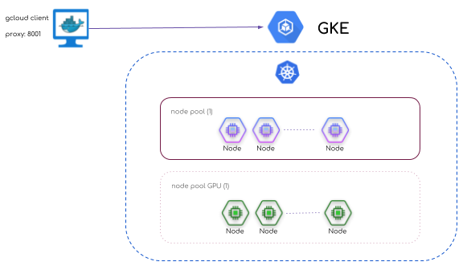

# k8s-gke


This project is intended to deploy a kubernetes cluster on GKE through a 
local docker container.

This is the schema of this simple deployer:



##Requirements

- Make (gcc)
- Docker (17+)
- GCP project and the json file with credentials and GKE service enabled for your account.

##HOW TO

###Setup 

You have to provide some variables to connect with GKE service correctly.

You may use env variables, modify variables directly on Makefile or load variables from other source, for instance from a sh file:

```bash
GCP_CREDENTIALS=/path/project-*******.json
GCP_ZONE=europe-west4-a
GCP_PROJECT_ID=my_project
GKE_CLUSTER_NAME=my_cluster
GITHUB_TOKEN=**********
GKE_CLUSTER_VERSION=1.10.7-gke.1
GKE_NODES=2
GKE_NODES_MAX=5
GKE_IMAGE_TYPE=n1-standard-8
```

###Create a cluster

Just type:

```bash
source k8s-gke.sh
make gke-bastion gke-create-cluster gke-ui-login-skip gke-proxy gke-ui 
```

When command above ends a web browser should be opened with the kubernetes dashboard.

If you want to use helm then tiller installation on kubernetes cluster is required:
```bash
make gke-tiller-helm
```

Now you can use the container gke-bastion as proxy for any gcloud or kubectl command, for instance:

```bash
docker exec -it gke-bastion bash -c 'gcloud compute accelerator-types list'
docker exec -it gke-bastion bash -c 'kubectl cluster-info'
```

###Add node pool

```bash
GKE_NODE=3 GKE_NODE_MAX=10 GKE_IMAGE_TYPE=n1-standard-4 GKE_POOL_NAME=poor make gke-create-pool 
```


###Add gpu node pool

```bash
GKE_GPU_AMOUNT=2 GKE_GPU_TYPE=nvidia-tesla-v100 make gke-create-gpu-pool 
```

After pool of gpus is available you'll need to add drivers to nodes: 

```bash
make gke-create-gpu-nvidia-driver
```

###Clean all

```bash
make clean-all
```
